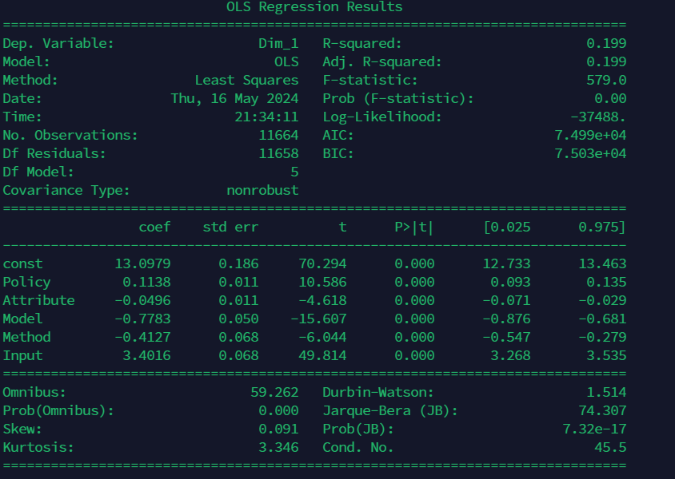

# 回归分析结果

从多元回归分析结果中，我们可以得到以下信息：

## 模型总体适配度

- **R-squared（R平方）** 值为0.199，这意味着模型解释了19.9%的数据方差。这表明模型的解释力有限，但在社会科学等领域，R平方值较低的模型仍然具有实际意义。
- **F-statistic（F统计量）** 值为579.0，且其P值接近0，说明整体模型显著。

## 回归系数及其显著性

- **常数项（const）**：13.0979，显著（P<0.001）。这代表在所有其他变量为0时，分数的基准值。
- **Policy**：系数为0.1138，显著（P<0.001）。这表明政策（Policy）对分数有正向影响，政策值每增加1，分数增加0.1138。
- **Attribute**：系数为-0.0496，显著（P<0.001）。这表明属性（Attribute）对分数有负向影响，属性值每增加1，分数减少0.0496。
- **Model**：系数为-0.7783，显著（P<0.001）。这表明模型（Model）对分数有负向影响，模型值每增加1，分数减少0.7783。
- **Method**：系数为-0.4127，显著（P<0.001）。这表明方法（Method）对分数有负向影响，方法值每增加1，分数减少0.4127。
- **Input**：系数为3.4016，显著（P<0.001）。这表明输入类型（Input）对分数有显著正向影响，输入值每增加1，分数增加3.4016。

## 相关性分析结果

相关性分析结果表明各维度与分数之间的相关性：

- **Policy**：与分数呈现正相关，相关系数为正。
- **Attribute**：与分数呈现负相关，相关系数为负。
- **Model**：与分数呈现负相关，相关系数为负。
- **Method**：与分数呈现负相关，相关系数为负。
- **Input**：与分数呈现显著正相关，相关系数为正。

## 统计分析结果

统计分析结果显示了每个维度的每个指标的平均分数：

- **Policy**：不同政策的平均分数有较大差异，可以帮助识别哪些政策更有助于提高分数。
- **Attribute**：不同属性的平均分数也有差异，某些属性可能更有助于提高分数。
- **Model**：不同模型的平均分数显示了模型性能的差异，Model 0和Model 3表现较好。
- **Method**：不同方法的平均分数显示了方法性能的差异，Method 0和Method 2表现较好。
- **Input**：不同输入类型的平均分数显示了输入类型的影响，Input 1（both）表现最好。

## 可视化结果解释

### 平均分数条形图

- **Policy 平均分数条形图** 显示了不同政策的平均分数。某些政策（如Policy 0）可能在提高分数方面表现较好。
- **Attribute 平均分数条形图** 显示了不同属性的平均分数。某些属性（如Attribute 0）在提高分数方面表现较好。
- **Model 平均分数条形图** 显示了不同模型的平均分数。Model 0和Model 3表现最好。
- **Method 平均分数条形图** 显示了不同方法的平均分数。Method 0和Method 2表现较好。
- **Input 平均分数条形图** 显示了不同输入类型的平均分数。Input 1表现最好。

### 相关性热图

相关性热图展示了各维度与分数之间的相关性。Policy和Input与分数正相关，Attribute、Model和Method与分数负相关。

### 回归系数条形图

回归系数条形图展示了每个维度的回归系数，帮助我们量化每个维度对分数的具体影响。输入类型（Input）对分数的正向影响最显著。

## 结论

通过对聚类、回归分析、相关性分析和统计分析的综合解读，我们可以得出以下结论：

- **Policy 和 Input** 对分数有显著正向影响，优化这些维度可以提高分数。
- **Attribute、Model 和 Method** 对分数有负向影响，说明这些维度需要进一步优化。
- 回归分析、相关性分析和统计分析相结合，提供了详细的指标对分数影响的量化评估，有助于识别关键因素，进行有针对性的优化。

## 回归分析详细表格

